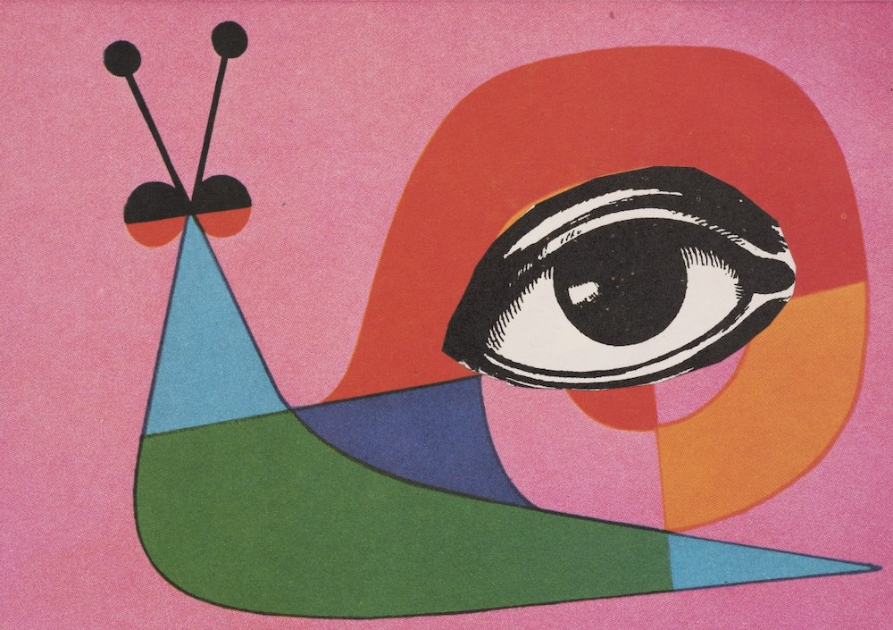

title: "Swinging London | Hazlitt Holland-Hibbert"
date: 2021-07-04
slug: /swinging-hazlitt
tags:
  - David Hockney
  - Gerald Laing
  - Peter Blake
  - Eileen Agar
  - Hazlitt Holland-Hibbert
  - Redfern Gallery
  - Waddington Custot
  - London

Three linked exhibitions this week, each carrying with them a whiff of patchouli oil and pot. It’s not quite (yet) a Summer of Love in London, but these shows all reach back to the 1960s, Pop and Op and very big floppy collars.

The biggest and floppiest is being sported by legendary fashion designer Ossie Clark, sketched at home by the still more legendary (and decade-defining) David Hockney. This delicate pencil drawing is [on show at Hazlitt Holland-Hibbert](https://hh-h.com/usr/library/documents/main/press-release-swinging-london-12-april-2021.pdf), in the bluntly but accurately titled exhibition, *Swinging London*

*Ossie Clark. Powis Terrace (1968)*

Clark’s demeanour is as noble-but-apprehensive as a Titian, his fat sausage fingers clinging for dear life to his teacup. The delicacy of Hockney’s genius pencil, outlining that collar, contrasts with blunt boldness of his 60s British counterparts elsewhere in the exhibition.

The highlights are a pair of homegrown Pop artists, Allen Jones’ *You Dare* featuring an aluminium staircase integrated into a landscape painting, and Gerald Laing’s painted Ben-Day dots of space-walking astronauts.

Over the road at Waddington Custot, Peter Blake’s [got a show of collages](https://www.waddingtoncustot.com/exhibitions/167/), which carries some of the vim and humour of his Pop colleagues. Most famous for his collage’d cover of that most 60s of albums, the Beatles’ *Sergeant Pepper’s Lonely Hearts Club Band*, Blake’s stuck with his cutouts in the intervening years, with a new series inspired by that great 20th century recluse, Joseph Cornell.

Blake imagines Cornell with a much fuller and richer life than he actually had. Far from a shut-in in New York, Blake has him - or at least a photo cut-out - travelling to the opera, to Amsterdam, and to the Parthenon, often accompanied by beautiful dancers and film-star blondes, from Marilyn to Pamela Anderson to Debbie Harry.

*Peter Blake: Time Traveller (installation view)*

In a video accompanying the show, Blake confesses: “Collecting is a phenomenon within my work. There are collections where I’m collecting material that will be made into something and leave me.” Such generosity.

Another eccentric active during the 60s, Eileen Agar, has an exhibition at [The Redfern Gallery](https://www.redfern-gallery.com/exhibitions/69/), along with younger artists inspired by her. Though she came to fame much earlier than the other artists mentioned - even featuring in the famous International Surrealist Exhibition in 1936, she kept working throughout the century.

*Untitled Collage (Snail) (c. 1970)*

Agar’s small, blocky, jewel-like acrylic paintings and collages capture some of the spirit of that age. Groovy as a lava lamp, she fits and clicks with her counterparts elsewhere in Mayfair.

Time that’s long since lost, now recaptured this summer, for this viewer at least.

*Swinging London is at Hazlitt Holland-Hibbert (London). 12 April 2021 -*
